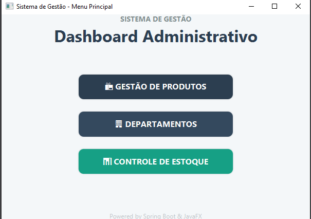
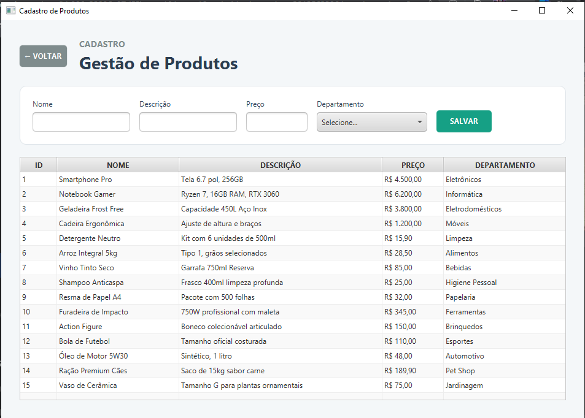
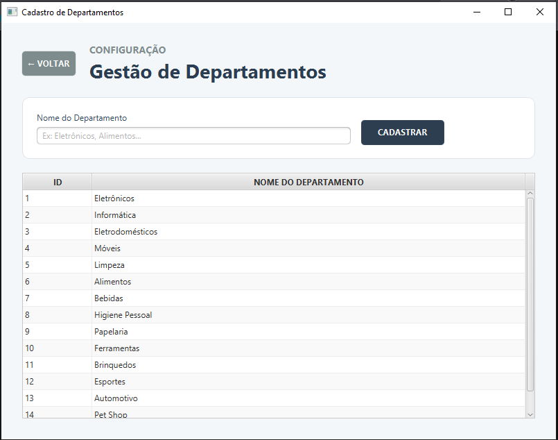
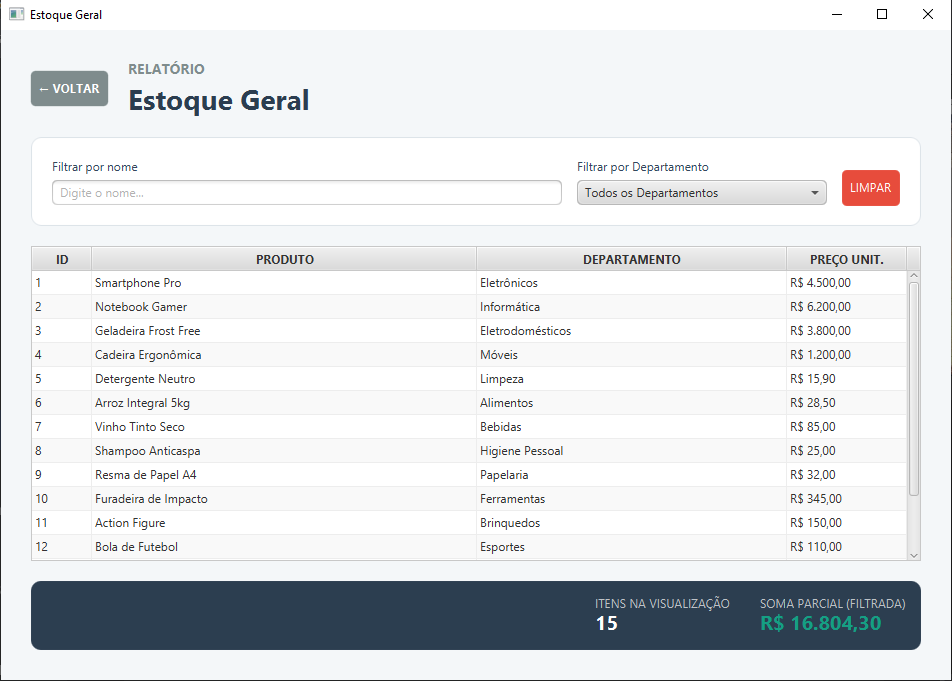

# JavaFX ERP - Gestão de Estoque e Produtos

<p align="center">
  
</p>

Sistema de gerenciamento de estoque e controle de departamentos desenvolvido com **JavaFX** no front-end e **Spring Boot** no back-end. O projeto utiliza o **PostgreSQL** como banco de dados relacional e demonstra a aplicação de padrões de projeto como DTO, Service, Repository e uma interface reativa.

## 📍 Sumário
- [Funcionalidades](#-funcionalidades)
- [Tecnologias Utilizadas](#️-tecnologias-utilizadas)
- [Arquitetura](#-arquitetura)
- [Documentação da API (Swagger)](#-documentação-da-api-swagger)
- [Configuração do Banco](#️-configuração-do-banco-de-dados)
- [Como Executar](#-como-executar)

---

## 🚀 Funcionalidades

### 📦 Gestão de Produtos
<p align="center">
  
</p>

- **CRUD Completo:** Cadastro, edição e exclusão de produtos com persistência em tempo real.
- **Interface Inteligente:** Ao selecionar um produto na tabela, os campos são preenchidos automaticamente e o botão de "Salvar" alterna para "Atualizar".
- **Seleção por Departamento:** Vinculação dinâmica de produtos a departamentos via ComboBox.

### 🏢 Configuração de Departamentos
<p align="center">
  
</p>

- **Categorização:** Organização do estoque através de departamentos específicos.
- **Integridade Referencial:** Lógica de segurança que impede a exclusão de departamentos que contenham produtos vinculados.

### 📊 Relatórios e Controle de Estoque
<p align="center">
  
</p>

- **Busca Multi-Filtro:** Filtre o estoque por nome do produto ou por departamento simultaneamente.
- **Cálculos Automáticos:** O sistema exibe a quantidade de itens e a soma total do valor financeiro em estoque com base nos filtros aplicados.
- **Localização:** Preços exibidos no padrão monetário brasileiro (R$).

---

## 🛠️ Tecnologias Utilizadas

- **Linguagem:** Java 17 / 21
- **Back-end:** Spring Boot 3, Spring Data JPA, Hibernate.
- **Front-end:** JavaFX, FXML, Scene Builder.
- **Documentação:** Swagger UI (OpenAPI 3).
- **Banco de Dados:** PostgreSQL.
- **Build Tool:** Maven.

## 🏗️ Arquitetura

O projeto foi estruturado em camadas para garantir escalabilidade e manutenção:

1. **Entities:** Mapeamento objeto-relacional (JPA).
2. **DTOs:** Objetos de transferência de dados para desacoplamento da entidade.
3. **Controllers (JavaFX):** Gerenciamento da lógica da interface e interação com o usuário.
4. **Resources (REST):** Endpoints para consumo da API via Web/Swagger.
5. **Services:** Camada de regras de negócio.
6. **Repositories:** Interface de comunicação com o banco de dados.

## 📖 Documentação da API (Swagger)

O sistema conta com documentação interativa para os endpoints do backend. Com a aplicação rodando, acesse:

- **Swagger UI:** `http://localhost:8080/swagger-ui.html`
- **Docs JSON:** `http://localhost:8080/v3/api-docs`

---

## ⚙️ Configuração do Banco de Dados

O sistema utiliza as tabelas `producttb` e `departmenttb`. Certifique-se de configurar o seu `application.properties` ou arquivo `.env`:
```properties
spring.datasource.url=jdbc:postgresql://localhost:5432/javafx-springboot
spring.datasource.username=seu_usuario
spring.datasource.password=sua_senha
spring.jpa.hibernate.ddl-auto=update
🚀 Como Executar
Pré-requisitos
Java 17 ou superior instalado.

Maven instalado.

PostgreSQL rodando localmente.

Passos para Instalação
Clone o repositório:

Bash
git clone [https://github.com/seu-usuario/javafx-springboot.git](https://github.com/seu-usuario/javafx-springboot.git)
cd javafx-springboot
Compile e execute a aplicação:

Bash
mvn clean install
mvn javafx:run
👨‍💻 Autor
Paulo Fernando da Silva Magio

Estudante de Análise e Desenvolvimento de Sistemas (ADS).

Focado em desenvolvimento Full Stack Java e Ecossistema Spring.

📄 Licença
Este projeto foi desenvolvido para fins de estudo e portfólio.